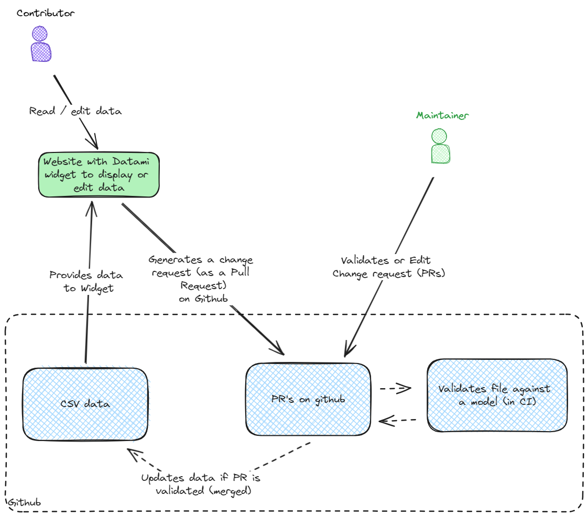
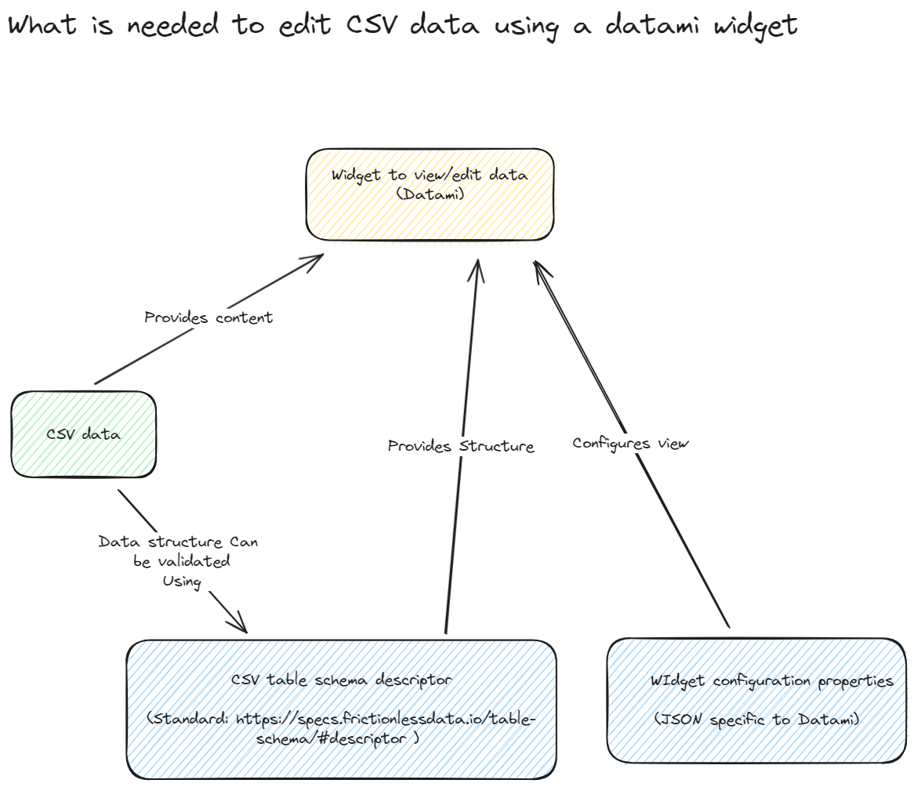

# 🗺️ Mapping of the ICT Sustainability Tools Landscape

This repository aim at providing to the global IT Sustainability community a vendor-neutral, fact-based, non-judgmental and exhaustive repository of the tools and services available to assess the environmental footprint of IT components.

It defines a data model that can be used to build an inventory of the tools.

> [!CAUTION]
> Today, any data contained in this repository is not validated nor reviewed. It is likely that the data contains completely false assumptions. It is here as sample data for the sole purpose of development and testing of the model. It should NOT be used for anything else.

> [!WARNING]
> The data model is still very drafty and is expected to evolve.

- [🗺️ Mapping of the ICT Sustainability Tools Landscape](#️-mapping-of-the-ict-sustainability-tools-landscape)
  - [Repository content](#repository-content)
  - [How to configure the widget](#how-to-configure-the-widget)
  - [Implementation](#implementation)
    - [Architecture decisions records / ADRs](#architecture-decisions-records--adrs)
    - [General design](#general-design)
      - [Usage flow](#usage-flow)
      - [Components](#components)
    - [Data format](#data-format)
    - [draft dataset](#draft-dataset)
    - [Example Datami widgets](#example-datami-widgets)

## Repository content

- doc/ : documentation
  - architecture decision records: [doc/adr/](doc/adr/)
- ictst
  - ictst/data
    - Main data file (CSV): [ictst/data/tools.csv](ictst/data/tools.csv) 
    - Data validation model: [ictst/data/tools.resources.yaml](ictst/data/tools.resources.yaml): Used in command line or via github actions.
  - ictst/model
    - data model used to configure the widget: [ictst/model/tools.frictionless-table-schema.json](ictst/model/tools.frictionless-table-schema.json)
  - ictst/widget:
    - widget html: [ictst/widget/tools-widget.html](ictst/widget/tools-widget.html)
    - additional fields configuration for the widget [ictst/widget/tools.fields-custom-properties.json](ictst/widget/tools.fields-custom-properties.json)
- .github/workflows : github action to automate the data validation
- old-examples/: other examples of using Datami

## How to configure the widget

[How to configure the widget](doc/how-to-configure-widget.md)

## Implementation

### Architecture decisions records / ADRs

- [All ADRs](doc/adr/)

### General design

We use a [Datami](https://datami-docs.multi.coop/?locale=en) widget to display data and allow edition of a file stored in Github. Even if end user is not familiar with Git.

1. data is stored in GIT to benefit from historisation, review and approval workflows (and potential automatic validation of format)
2. data update can be proposed by end users in 2 ways:
   1. A web frontend that allow to view the data and propose edition => This is the **preferred** solution using Datami widget
   2. Pull requests directly against the data file (git) => **Less preferred** (mainly for maintainers of people familiar with Git)

#### Usage flow



#### Components



> [!WARNING]
> The data validation and the data edition (widget) are configured using different set of files or data models.
> These data model use different syntax but have to be kept in sync manually !

### Data format

- [x] We store data as a csv file.
- [x] add specific descriptors as table-format to describe and validate constraints on the fields.
- [x] implement frictionless-ci or other automatic validation regarding format as a github action [frictionless-ci | Frictionless Repository](https://repository.frictionlessdata.io/index.html)

> [!NOTE]
> Our preferred format would have been to have a structured (json) file, described by a json schema. However json edition is not well supported by Datami yet. (JSON data is displayed as json tree which is not very user friendly for non technical users). So for the time being we fall back to using a less structured CSV dataset.

### draft dataset

See [draft dataset](old-examples/ict-sustainability-tools.csv)

### Example Datami widgets

- A CSV file displayed without any customization [old-examples/csv/csv-widget-basic.html](old-examples/csv/csv-widget-basic.html)
- A CSV file displayed with some additional constraints on fields [old-examples/csv/csv-widget-with-constraints.html](old-examples/csv/csv-widget-with-constraints.html).
- Other examples with more complex validation rules:[GitHub - demeringo/datami-tests: Testing datami widget to edit and validate csv files](https://github.com/demeringo/datami-tests/)

---

## Mini server for local development

A mini server is writen in the `server.py` to serve this folder's files.

To install the mini-server :

```sh
pip install --upgrade pip
python3 -m pip install --user virtualenv
python3 -m venv venv
source venv/bin/activate
pip install --upgrade pip
pip install -r requirements.txt
```

or

```sh
sh setup.sh
source venv/bin/activate
```

---

### Run local server

To run the server on `http://localhost:8800`:

```sh
python server.py
```

or

```sh
sh run_server.sh
```

Files will be locally served on :

- `http://localhost:8800/content/<path:folder_path>/<string:filename>`
- `http://localhost:8800/statics/<path:folder_path>/<string:filename>`
