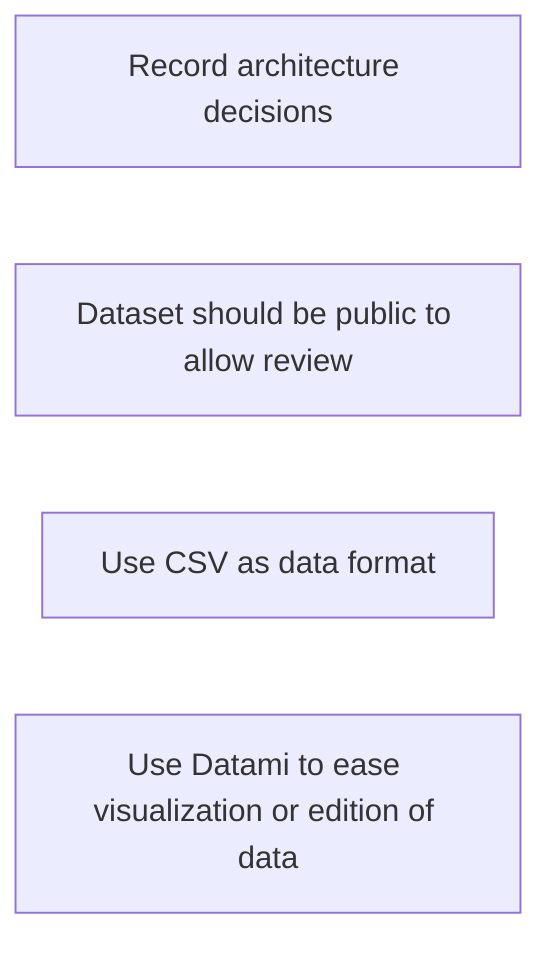

```mermaid
graph LR
0000[Record architecture decisions]
click 0000 "0000-record-architecture-decisions.md"
0001[Dataset should be public to allow review]
click 0001 "0001-dataset-should-be-public-to-allow-review.md"
0002[Use CSV as data format]
click 0002 "0002-use-csv-as-data-format.md"
0003[Use Datami to ease visualization or edition of data]
click 0003 "0003-use-datami-to-ease-visualization-or-edition-of-data.md"
```
