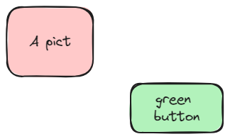

# How to use this tool

## Visualizing the data 

> 💡 TODO: describe here how the interface works, possibility to see table or cards view, filtering capabilities.

## Contributing to the data

### The general contribution process

> 💡 TODO: Describe here how contribution are managed / reviewed

### How to edit the data

## Other info

See also this [next chapter](how-to-something-else.md).